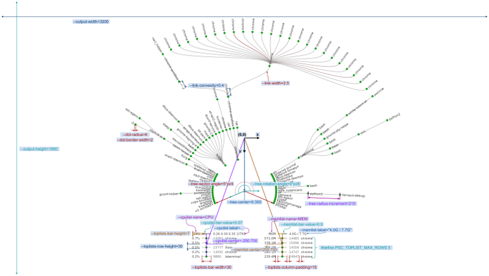
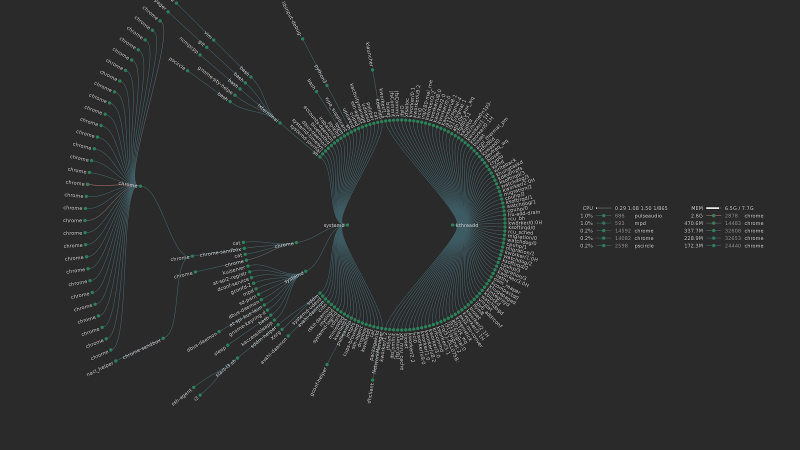
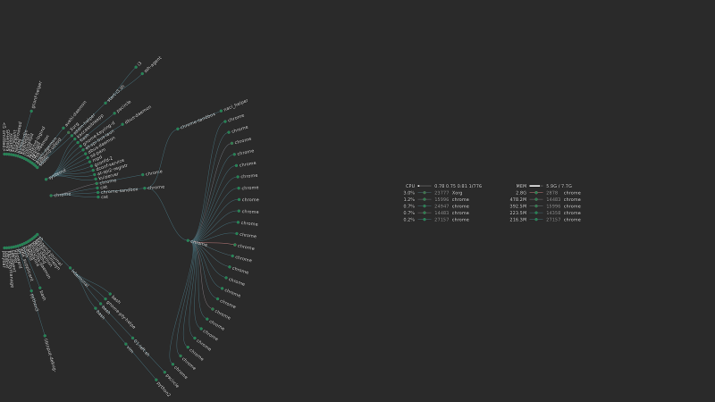
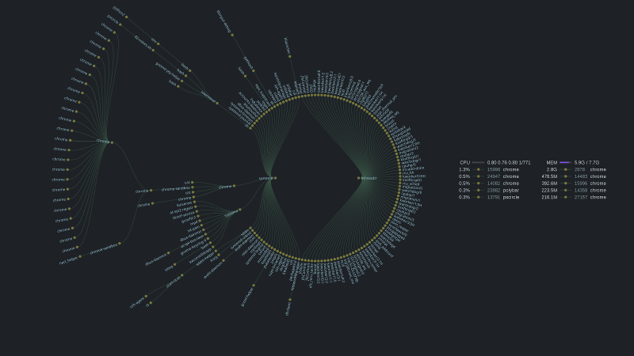
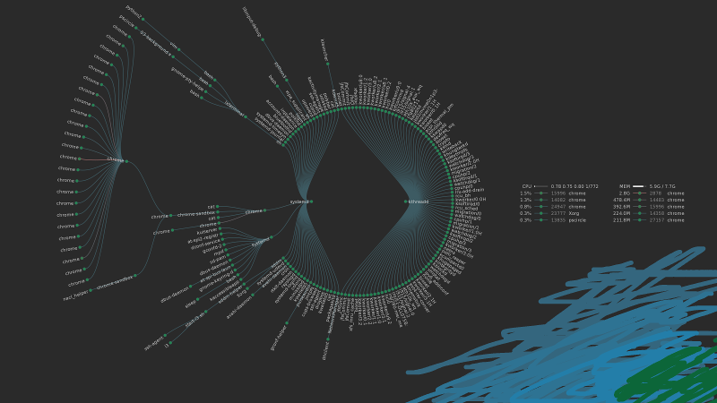
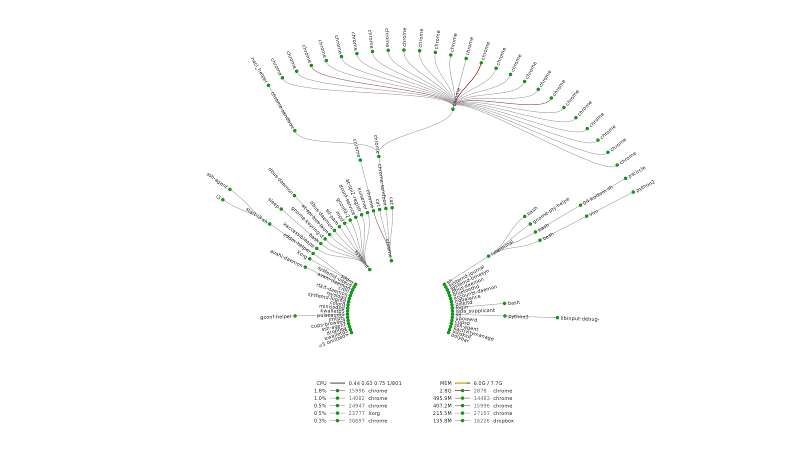

# pscircle 

**pscircle** visualizes Linux processes in a form of radial tree.

*fork by Ruslan Kuchumov, 2018* (https://gitlab.com/mildlyparallel/pscircle)

# Installation

## Compiling from the source code

Make sure you have [meson](http://mesonbuild.com/Getting-meson.html) and [ninja](https://ninja-build.org/) build systems installed.

You will also need the following dependencies:

*  libcairo
*  libpng
*  libx11 (optional; if disabled output only to PNG file will be supported)

In Debian-based distributions you can install them from the repository:

```bash
# Ninja and Meson build systems
sudo apt-get install -y ninja-build python3-pip
pip3 install meson

# Dependencies
sudo apt-get install -y libpng-dev libcairo2-dev libx11-dev
```

> In other distributions the process is similar, but the names of the packages may differ

To compile and install *pscircle* call:

```bash
mkdir build && cd build
meson ..
ninja
sudo ninja install
```

In case you want to compile without X11 support, call `meson configure -Denable-x11=false` before compiling.

After installation and configuration you may want to create systemd service to regularly update desktop wallpaper:

```bash
mkdir -p ~/.config/systemd/user/
cp examples/pscircle.service ~/.config/systemd/user/
systemctl --user enable pscircle
systemctl --user start pscircle
```

## Installing from repositories

### ArchLinux AUR

A package is available on the AUR as
[pscircle-git](https://aur.archlinux.org/packages/pscircle-git/).

### Gentoo ebuild

Gentoo ebuild is available in [examples/pscircle-9999.ebuild](examples/pscircle-9999.ebuild) 
(by [_ahrs](https://www.reddit.com/r/unixporn/comments/8v9r19/oc_ive_just_created_a_program_for_drawing_process/e1qmuie)).

## Usage

To view complete list of command line arguments run:

```bash
pscircle --help
```

Parameters related to visualization are described in the following diagram:

[](docs/parameters.png)

[full size](docs/parameters.png)

By default image will be printed directly to X11 root window of the display specified in `--output-display=...`. But you can print image to PNG file by specifying `--output=pscircle.png` argument. (Check [#6 example](examples/06-output-to-image.sh))

When you finish configuring command line arguments you can modify corresponding constants in [config.h.meson](config.h.meson) and recompile the application so that your configuration would be used by default.

## Using *pscircle* with desktop environments

GNOME, KDE, XFCE and, probably, some other DE do not display X11 root window as desktop wallpaper. But you can still save the image to the file (by using `--output=path.png`) and either:

* Set the path to the image in wallpaper system config. DE is likely to update the wallpaper automatically, when the image has changed.
* Create your own script for updating the wallpaper after *pscircle* is called. (I'd appreciate if you share it.)

> Hint: you can place the image in `/tmp` directory which is often mapped to the main memory. It omits writing to the disk and improves performance.

# Examples

For more examples check [examples](examples/) directory.

## Default

[](docs/default.png)

[full size](docs/default.png)

## Tree at the left

[](docs/parameters.png)

[source](examples/01-left.sh) | [full size](docs/parameters.png)

## Different fonts and colors

[](docs/02-colors.png)

[source](examples/02-colors.sh) | [full size](docs/02-colors.png)

## Background image

[](docs/03-background.png)

[source](examples/03-background.sh) | [full size](docs/03-background.png)

## Tree at the bottom

[](docs/04-bottom.png)

[source](examples/04-bottom.sh) | [full size](docs/04-bottom.png)

# Rationale 

## Graph doesn't fit to my screen

By default *pscircle* creates an image for 3200x1800 resolution. If you have a different screen resolution, you should manually specify it by changing `--output-width` and `--output-height` options. You will probably need to change other options related to sizes (e.g. font size, circles radii, lists positions) as their values are specified in absolute values and do not scale automatically. [Example #5](examples/05-1440x900-res.sh) may help you with this.

Another reason the graph doesn't fit to the screen is that you have too much processes. In this case you can reduce circle radii (by changing `--tree-radius-increment` option), limit the number of child processes (`--max-children` option) or change the PID of the root procces (`--root-pid` option). You can also hide lists of the processes with `--cpulist-show=false` or `--memlist-show=false` to get more free space at the screen.

## How does *pscircle* obtain its data?

*pscircle* reads `/proc` Linux pseudo file system for collecting information about processes, uptime, CPU and memory utilization. It calculates processes pcpu and CPU utilization values over the time interval specified in `--interval` argument. This implies that *pscircle* execution is suspended for this time interval to collect the data. If you want these values to be calculated from the process and system start time (similar to `top` or `htop` utils), you can specify `--interval=0` argument.

In case *pscircle* doesn't work correctly with your kernel version (please, let me know), or you want to monitor remote host you can provide this information yourself. (Check [example #7](examples/07-no-proc-fs.sh))

## Performance

When you compile *pscircle* with `#define PSC_PRINT_TIME 1` cpu time and wall time for different stages will be printed:

Execution times of printing the image to X11 root window:

```
                  cpu /   wall 
         init: 0.0292 / 1.0296 seconds
      arrange: 0.0003 / 0.0003 seconds
    draw tree: 0.0844 / 0.1443 seconds
   draw lists: 0.0009 / 0.0031 seconds
        write: 0.0000 / 0.0000 seconds
        total: 0.1149 / 1.1772 seconds
```

Execution times of printing the image to PNG file:

```
                  cpu /   wall 
         init: 0.0199 / 1.0200 seconds
      arrange: 0.0001 / 0.0001 seconds
    draw tree: 0.1062 / 0.1062 seconds
   draw lists: 0.0009 / 0.0009 seconds
        write: 0.3211 / 0.3211 seconds
        total: 0.4481 / 1.4483 seconds
```

As you can see, drawing the tree to the file (on SSD disk) take almost 4 times longer that printing to X11 screen (0.11 vs 0.45 seconds of cputime). 

## Multiple display environment

As *pscircle* is not tested yet in multi-display environment to make it work correctly, I suggest trying the following options:

* specify `--output-display=...` argument to print the image to the correct display, or
* change `DISPLAY` environment variable before running the program, or
* output image to the file using `--output=...` argument and then set it as the wallpaper using external command (e.g. `feh`).

# Contributing

You can suggest your desired features [here](https://gitlab.com/mildlyparallel/pscircle/issues/7) and vote for the features suggested by other users.

# Asknowlegemnts

Thanks Bill MIll for writing an article on [tree visualization algorithm](https://llimllib.github.io/pymag-trees/) which was used in this program.
